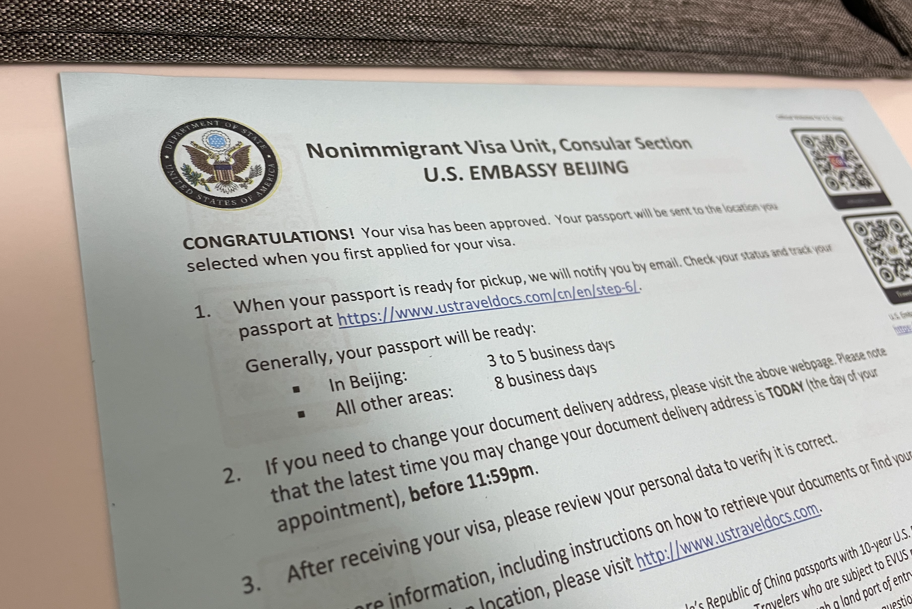

# 2024 暑研记录 Part.1 [套磁 -> 面签]

关键词：CS，暑研，UT Austin

## 套磁

我是从寒假开始前 ETH 的官方项目开始套的，这个项目我不打算详细介绍因为被表刷了，对之后的一些流程帮助不是特别大，直接掠过。

寒假刚开始的时候实验室里推了一个 Stanford 组的暑研机会，但准备不充分，让我做的 slides 里我写的全是文字，表现也不好就被拒了，但是第一次感受了一下被面试的感觉。事后回想起来其实也不想去（养蛊）。但当时因为焦虑和侥幸心理一直在等回复，导致节前节后都没做什么事情。快开学的时候被明确拒了，才开始真正套磁。当时感觉是已经有点点晚了。当时非常不幸的患上了醒来第一件事哪怕还迷迷糊糊地也要看邮件综合征。

因为我在实验室实习的时候有比较具体的方向（Human Motion），所以找暑研的时候也比较有针对性，但这个方向相对来说比较小众，然后当时自己胆子也比较小所以找的很保守，最后就筛出来十几个感觉可能比较符合的。一开始不太敢海套，十分担心如果同时有复数个人回复我会很尴尬，所以我是分批次三个三个套的，但是事后发现这是杞人忧天，因为根本没人回我。**所以第一条建议，套磁先大胆套，套了再说。**
不过其中有一位老师非常符合：和实验室的老板有 connection，方向十分吻合，rising star，博后毕业刚入职 UT Austin，所以我当时的第一目标老师就是这个（后称希腊老师），之后去找老板问了下情况，总之最后和这个老师联系上了。接受了一次面试以后我当时感觉氛围还挺好的，感觉稳了，但是意外的最后被拒了，理由是 funding 问题（事后证明真正原因是老师担心语言问题）。这次面试我相对来说有经验一点，因为大概理解到了这种面试老师的意图，这次我就几乎都是可视化材料，我的做法是大概列给 table of content，然后每一页放点比较重要的内容展示一下经历的内容和自己做了的事情，然后在结尾的几页放一些可能用到的其它材料（例如 related works 的 pipeline）。
当时有点紧张，不知道咋办，因为时间也比较晚了，就直接去找老板帮忙了。然后老板叫我把简历大换血了一下，另外一方面我自己也在继续套。当时也知道套同一个学校的不同老师有点尴尬，但是毕竟无路可退了就有啥套啥了，套的时候方向也没那么强相关、然后还是看看有没有实验室的 connection 可以利用一下。其中我给 Austin 的另外一个华人老师套了一份，但是非常有意思是的，那位华人老师加了我微信以后说他和我之前套的那个老师又讨论了一下，说决定给我第二次面试（当时看到我真是脚趾扣地）。但是实际上第二次面试是纯面语言的，那位华人老师和我安排了一次非常简单的微信语音面，但全程问的都是我的语言怎么样，也告诉我之前那个希腊老师最担心的就是语言问题，我们在第一次面试的时候我有些话没太听清（我的听力没那么熟练+语音质量不好+希腊老师的英语有点咖喱味），所以可能有这方面的顾虑。反正最后这个华人老师是觉得我语言水平是够的了，所以最后又把我推回给了希腊老师，最后终于算是套到了。（太戏剧了，感谢贵人！）

## 签证

上面的内容比较私人没太有参考性，不过下面的应该稍微有点参考意义。我详细记录了从我开始和学校秘书对接后的全过程，因为在做这些事的时候我都是走一步看一步，非常迷茫，所以我希望我记录的这些东西能给大家带来一些帮助。总的来说暑研签分两个部分，一个是拿到 DS2019 form 之前，和学校对接的过程，另外一个是拿到 DS2019 form 之后，预约面签的过程。

我首先按照 UT Austin 的行政顺序来讲述过程，然后最后再给一个我建议可以提前做的事情的列表。我当时比较在意的是哪些东西是可以短期弄出来的，哪些是不行，最好提早准备的，所以我会按照这个思路进行整理。

### 获取 DS2019 之前 // Step 1/2

Admin 发的第一封邮件中告诉我需要完成四件事，包括：

1. 填写一份问卷
2. 注册一个帐号（UT Austin 的某种学生管理系统的帐号）
3. 提供一份资金证明
4. 一份语言证明（托福 79+ / 雅思 6.5+）或 "Texas Global ELC interview"

- 第一份问卷就是简单介绍一下自己的情况，以及科研内容和科研目的，这个可能需要和导师商量，但是我基本上是自己完成的。
- 第二个注册帐号这件事没啥难度，也没有任何需要等的过程，不过我当时用 Arc 浏览器没法很丝滑的使用那个网站，后来切了 Safari。
- 第三个资金证明，在数额方面，学校给了一个参考价位，1708$ 每月，假设项目有两个月，那就需要有一个 2 * 1708$ 的存款证明，但要不要冻结、美金还是人民币之类的事情完全没说，我最后是保险起见全都是美金，冻到了项目出发之前，然后我是在玉泉门口的**中国银行**开的，大部分工作都可以在手银里弄完，然后线下去那边打印一份纸质证明即可。
> 如果不确定具体流程，可以先去银行，边问边做下面这些事，尽量问柜台，我去的时候前台也不是特别了解 App 的操作细节，和柜台描述的内容是有差异的，如果人不多可以直接去问柜台怎么操作。
>
> 1. 中国银行手银「结售汇」，购汇美元（不是购钞）
> 2. 中国银行手银「存款证明」，办理电子版然后去玉泉门口的中国银行打印盖章
- 第四个，这个我吃了很大的亏，我之前一直以为暑研没有语言要求，但实际上不是没有只是比较低（可能有些学校确实没有），我当时对托福的准备只有每天在背单词，没做过题也没调查过，所以非常慌，考虑到时间问题我直接当场定了一个最近的一周后紫荆港的托福，事实证明这个选择没错。考托福的经历我不打算在这里介绍，大概情况就是 79 这个分好像不难，我英语水平一般，脱产一周就考了个 89，但是算上等成绩的时间还是因为语言的问题拖了两周到三周，所以建议还是**提前准备好一份托福**。

总结一下，上面这四个材料，只有第四个是没法短期一下子弄出来的（暂时不考虑没钱的问题x）。不过我当时和学校的 admin 确认了一下，能不能先让我继续后面的，这个语言成绩等我之后弄出来了再补，一开始回复不行但是后来又说可以了，所以其实我是提前进入了 step 2/2 的。当然，我去那个华人导师组的同学，貌似不需要提供语言这一条的材料，所以具体情况还是因人而异，但有条件最好还是提前准备一份语言成绩。

### 获取 DS2019 之前 // Step 2/2

需要去学校提供的网站地方填写大量表格，我就不按表格内容列了，我就把表格里需要的材料列一下，其中有一部分和前面是重合的：

1. 语言证明
2. 资金证明
3. 护照
4. Advisor Form
5. 安全承诺书
6. 接收 DS2019 的邮箱

- 语言证明的要求和前面是一样的，提交方式感觉很随意，我直接托福网站截图就行了（因为送分的那个纸头过了好久才送到，我等不了）
- 资金证明也一样，用之前的就行，注意要有英文版，中国银行的自带英文所以很省事
- 护照建议提前办，这个没啥困难的，直接东四求是派出所就能办不过有点慢，然后等几个工作日去领就行
- Advisor Form 是个让你现在的 advisor 填写的表格，比如校内实验室的老板，要你写个邮箱，然后会发邮件给老板让他用英文填
- 这个承诺书大概就是通知你一下你要买保险，然后介绍了几个保险，这个东西我其实现在还没弄的很清楚，但是当时反正只需要打个钩就行
- 填一个常用邮箱就行

其实这一步提交之前的主要的时间还是在等语言成绩，提交之后就看对面的行政效率了，我同学只用了三天但是我用了两周多。建议多催催。这里推荐一下我用的话术：

不要问有没有好、还有多久好，而是去问“我提交的材料是否有问题，since 已经多少天...”

### 获取 DS2019 之后，面签之前

收到 DS2019 后还会有 DS702，UT Austin 会给一个指示，我大概就是按照那个指示做的。你会用到的一些东西是：

- Project Number，格式是 X Y ZZZZZ，写在 DS2019 上
- SEVIS ID: Nxxxxxxxxxx，写在 DS2019 上
- DS 160 application code: xxxxxxxxxx，开始填写 DS160 后获得

这一部分杂事比较多，要写很多东西，建议大家维护一个信息表格方便自己随时查询。

- 交 SEVIS fee，在[这里](https://studyinthestates.dhs.gov/students/prepare/paying-the-i-901-sevis-fee)，需要填写个人信息，最后交完会有个收据和事务号。需要注意，这里不支持支付宝之类的支付方式貌似必须用信用卡（我用的是 VISA 信用卡，银联的我没试过但是好像也可以），所以可能需要麻烦家长帮忙，大概 1k6，我忘记美金多少了。
    - 当时因为我同学没有支付方式所以我帮他付了，所以信息也是我填的，我发现他名字写反了结果没发现我自己写反了x 后来给 FMJFEE.SEVIS@ice.dhs.gov 写了封邮件，一天之内就给我改好了。
- 填写 DS160，填写这个表格无比痛苦，~~我建议大家都体验一下便秘的填写感觉~~，我建议大家先写完前两个表格然后去做别的事情（如果提早结束可能之后这个表格你就登录不了了，我发现很多人都遇到这个情况，这种情况下开一个新的就行）。开始写这个表格以后你会看到一个代码，就是上面的 DS 160 application code，这个东西唯一确定一份 DS160 表格，你之后还会多次用到（🥲），然后你只需要找有空的时间写完它就行，只要获取这个 code 之后就能预约了，你只需要在面签之前提早几天写完并提交这个表格就行。表格中有大量信息，建议先准备好再开始写，否则你会无数次的看到 time out 然后重新写验证码登录、重新写没保存的那一页表格，总之很煎熬，这个表格我写了整整三个小时，其中至少有一个小时在重新登录。填写完这个表格后会有一个比较丑的蓝红色页面需要你保存一下，这个东西非常重要。
- 去[这里](https://portal.ustraveldocs.com)预约面签，你至少需要获得 DS160 application code （如果没写完确保你可以 recover 这个表格），先付钱后才能看到实际的预约时间，交了 185$，1400R 不到，然后我当时约的是 5.21 背景大使馆。（建议约时间的时候约 8:15 或 8:45 之类的，因为现场有个通道是按 0/30, 15/45 分流的，15/45 人会少一点。但是我印象里好像没看到这个时间，可能是不同签证时间不同，所以我也不确定这个。）预约完成后一个绿绿的页面需要保存一下，这个也很重要。

### 面签

- 我约的是北京，所以需要做一下简单的旅程规划，我和同学一起去的所以互相有个照应。HZ -> PK 的机票还好，但 PK -> HZ 的机票在白天有点贵 : (，然后住宿也很贵，大使馆附近的汉庭双床标间居然要 500 一晚。
- 出发之前准备好材料，我准备了这些：
    - [必备] 护照
    - [必备] 绿页预约单（面签预约完成后的页面）
    - [必备] DS160 确认页（蓝红色那个丑丑的页面）
    - [重要] SEVIS I-901 Payment（交完 SEVIS 费以后可以保存）
    - [重要] DS2019
    - [重要] DS7002
    - CV
    - Certificate of Deposit
    - Invitation Letter
    - 50 人民币（万一照相有问题可以现场拍，但是我没看到哪里能拍，这个是小红书的说法）
    - 其中必备的三个是想进大使馆必须带的，重要的几个是我知道会被 VO 问到的，剩下三个是以防万一带的，你可以再多带一点，我自己在面签的时候只被要了 DS2019 和 DS702。

实际面签的时候的体验：

- 排了好多好多队，你永远不知道你接下来要排的是何处的哪个队伍，人太多了。我们是 8:00 不到去排队的，实际面签就几分钟，但出来已经快十一点了，可以考虑带本书进去，毕竟你不能带电子产品，但是我觉得书可能会有点重x 再加上我觉得比起无聊站得累对我来说更难受一点。
- 有点迷茫，因为不知道接下来什么时候要干嘛，不过还好，实际上只需要按照顺序做下去就行。
- 面签的时候，我的 VO 问我要了 DS2019，然后问我是学什么的（她最后给我打的标签是 ML），然后我感觉可能有点敏感，赶紧补充了一句我 undergraduate（有学姐建议我这么做），她明显对此很感兴趣，敲了会键盘又问我一遍你还没毕业对吧，你什么时候毕业，然后确认了我 2025 才毕业后就给我过签了，所以大家可以提早说这个事情。
- 关于语言问题，VO 会说中文，但是有说法是 J1 最好还是英文沟通，我最后是用英文沟通的，但是中文应该还是可以的。
- 我同学非常不幸地被分配到了光头哥，被不讲理地拒了（光头哥没对着话筒说话他没听到，然后就被拒了。。）。所以我觉得大家有条件还是躲着点吧。

## 总结

准备了好多材料，太累了；花了好多钱，太疼了。

我认为在实际开始之前可以提前准备起来的东西：

1. 科研经历（一方面是经历，一方面是找 connection 以及了解领域情况）
2. 语言（可能不需要立刻刷出高分，但是最好有个成绩，先简单准备一下考一次再说）
3. 护照
4. 了解一下相关知识，我是完全摸着石头过河，整个过程一直都有些恐慌x
5. 早一点做时间规划，我是套磁前才决定要出国的，所以时间线十分紧张，建议学弟学妹都早点做准备x

## 废话

诶，之后还有一些事情需要解决，保险、租房，实际的美国生活，等等，这些等下次再更新吧。这次能写出来都是因为我过程中一直在记录自己做了什么事要做什么事，否则我绝对要搞不清楚自己在干嘛了x

最后祝还没签的同学丝滑过签，之后要暑研的学弟学妹都能找到心仪的暑研！

蓝条镇楼！

