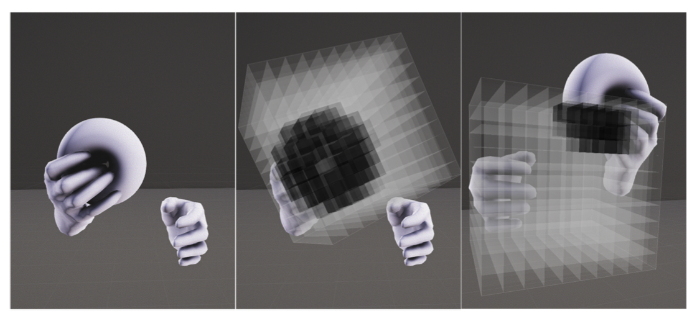

# ManipNet: Neural Manipulation Synthesis with a Hand-Object Spatial Representation

Insight:

- 对于学习物体几何特征这件事：
    - 粗略地学习整体，而精细地学习局部（稀疏但完善）能得到较好的泛化性！

---

## 输入输出

- Inputs: 6D trajectories of wrist & object, mesh of hand, 3D geometry of the objects
- Outputs: dexterous manipulation of the object

> 根据输入的手和物的轨迹（相对位置），生成实时手物交互。
>

## 方法

用 NN 从 trajectories of wrists and objects 来回归 finger 的动作。

向网络提供当前 finger pose，过去和未来的 trajectories 以及从中得到的 spatial representations，自回归地得到下一帧的 finger pose。

- [ ]  **疑问**：自回归的话，第一帧是怎么给的？

- 左右手用同一套系统对称的做两次
- 一个关键的点是如何表示手物之间的空间关系。
    - 一些工作表示，抓握的低维姿势主要取决于任务；高维姿势主要取决于物体的形态
    - 基于这个结论，使用 coarse 的物体整体形状表征，在手物足够接近时再使用 dense 的物体局部几何表征
    - 具体来说: We use a **low-resolution voxel occupancy grid to represent the object shape**. We find that **distance samples between the hand and the object surfaces** are effective low-dimensional signals that capture details well.
    - 然后训了一个 NN
- 三种类型的 sensor
    1. **Ambient Sensor: 编码手能接触到的地方的 volume occupied by objects**

        

        - 一个固定的范围和分辨率，被定位在手腕和中指根部的位置，覆盖手心方向的一块区域
        - 使用如下方式计算 volume 的占用情况：

        $$
        o=\left\{
        \begin{aligned}
        0 & \quad\text{no intersection,} \\
        1 - \frac{d}{s} & \quad\text{intersectrion,}
        \end{aligned}
        \right.
        $$

        - 其中 $d$ 是 object 到 cell center 的距离（cell 就是 sensor 里的一个“体素”），$s$ 是 cell 的边长
            - 因为 $s > \frac{ \sqrt{3} }{2}s$ 所以 $o$ 非负
        - 使用的分辨率比较小的原因：
            1. 增加分辨率可能导致时空开销变大；
            2. 用于训练的物体几何比较少，如果分辨率较高容易过拟合，为了增强泛化性，使用 coarse 的方法来得到整体的信息；
    2. **Proximity Sensor:（稀疏）从手出发，检测 human finger 的短期移动情况**

        

        - 在掌心方向的 mesh 上均匀地选择一些点作为 sensor 的出发点（104 totally），发射法向的 ray，直到它们碰到物体或太远，而这些 sensor 的量化方式为：

            $$
            d_j=\left\{
            \begin{aligned}
            sign(\mathbf{p}_j) ||\mathbf{p}_j-\mathbf{p}_c|| &\quad \text{ray-object intersection,} \\
            sign(\mathbf{p}_j)\delta_\text{max} &\quad \text{no intersection},
            \end{aligned}
            \right.
            $$

        - 其中 $\mathbf{p}_j$ 就是手上的 sensor，$\mathbf{p}_c$ 就是 ray 与物体的交点
        - 这样最终得到一个 104 dim 的 feature vector $\mathbf{d} = \{d_0,...,d_{103}\}$
        - 这个 sensor 并不直接反应物体的形状，因此能够增强泛化性
    3. **Signed Distance Sensor:（稀疏）从物体出发，检测哪里会发生 contact**

        

        - 对于手上的 22 个 joints，寻找 object 表面中分别距离这些 joints 最近的点，然后得到这些点的法向量，需要使用的就是这个距离和法向量（两个东西不直接关联“距离”连线和法向量存在夹角）

            $$
            \mathbf{s}_j=\left\{
            sign(\mathbf{p}_j) \min(||\mathbf{p}_j - \mathbf{p}_o||, \delta_\text{max}),\quad \mathbf{n}_o
            \right\}
            $$

        - 其中 $\mathbf{p}_j$ 是 joint position，$\mathbf{p}_o$ 是 object 表面距离 joint 最近的点，其法向量为 $\mathbf{n}_o$
        - 这样最终得到一个 22 dim 的 feature vector $\mathbf{s} = \{\mathbf{s}_0,...,\mathbf{s}_{21}\}$
        - 预先存 sdf 可以更快但是受限于分辨率，现在这样比较 expensive 所以只做 22 个 joints 的
        - 分开表示法向和距离有利于生成更加符合物理直觉的抓握动作（倾向于从法向靠近物体）