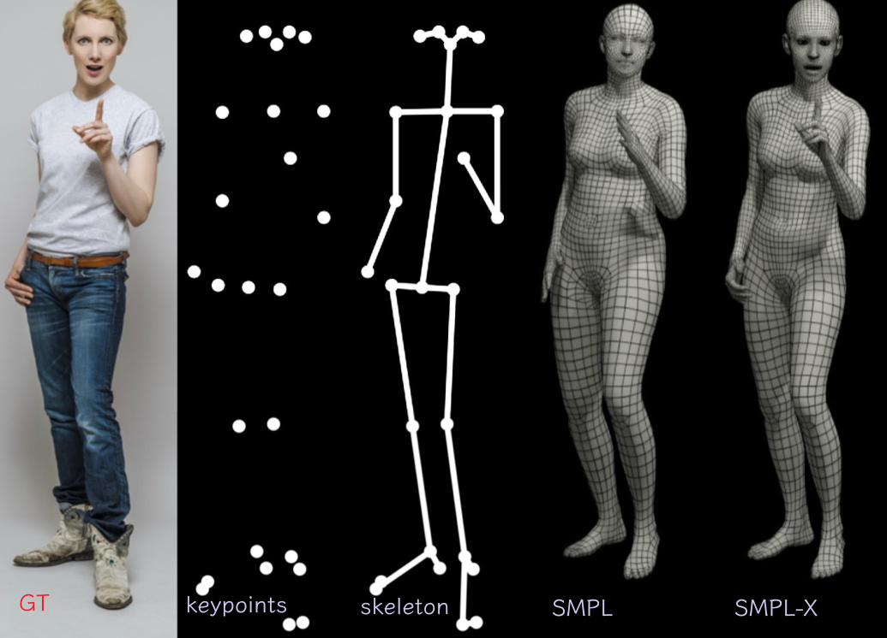

# [SMPLX] Expressive Body Capture: 3D Hands, Face, and Body from a Single Image

`3DV` `Representation` `HMR` `Optimization`

内容：SMPL-X 模型和 SMPLify-X 方法

---

## 挑战

- 想要捕获 3D 的人体、手、面信息，现在缺少 3D models 和 3D data
- 现有的方法对于 hand、facial expression 的捕获大多都与 body 隔离，少数方法通过缝合的方式整合在一起，即不是整体地去捕获

## 符号

- $N = 10475$: verticles 数量
- $K=54 ={24}^\text{body joints}+30^\text{finger joints}$: joints 数量，其中不算 pelvis
    - 具体定义：[https://meshcapade.wiki/SMPL#skeleton-layout](https://meshcapade.wiki/SMPL#skeleton-layout)
- $M(\theta, \beta, \psi)$: SMPL-X model function
    - $\theta\in\R^{3(K+1)}$: pose parameters, $K$ 是 body joints 数量，额外加上一个表示 global rotation
        - 将它进一步做划分：
        1. $\theta_f$: for jaw joint
        2. $\theta_h$: for finger  joints
        3. $\theta_b$: for the remaining body joints
    - $\beta\in\R^{|\beta|}$: shape parameters (body + face + hands)
        - 线性的 shape 系数，用于对 shape 正交主成分进行加权
    - $\psi\in\R^{|\psi|}$: facial expression parameters
        - 线性的 facial expression 系数，用于对 shape 正交主成分进行加权
    - 可以发现，面部表情不算在 pose 里，反而更像 shape

## 输入输出

- 输入：single controlled/in-the-wild image
- 输出：3D pose & 3D shape (3D mesh & 2D joints)，且包括面部和手部（SMPL-X model）

## 方法

> 沿袭 SMPL 的路子，首先提取 2D 的特征和信息，再通过优化来 fit 出 3D 的结果。即，改进了 SMPLify
>
>
> > 因为如果想要用 deep learning 的方式从 single image 去 regress SMPL parameters，来获得 hands 和 face，目前不存在合适的 dataset
> >

### SMPL-X

> 增加了手部和面部内容，将 SMPL 和 FLAME head model 和 MANO hand model 结合，参数是三个部分一起训出来的。
>
> - FLAME 除了捕捉面部和整个头部的信息，还会捕捉到脖子的一些信息（这一点对有效结合 head 和 body 至关重要）
- SMPL-X 使用 standard vertex-based linear blend skinning，并且包含了 learned corrective blend shapes，一共包含 N = 10475 vertices 和 K = 54 joints（body + neck + jaw + eyeballs + fingers）
    - SMPL vs SMPL-X 关于 joints 的对比
    - 
    - [https://github.com/facebookresearch/frankmocap/issues/91](https://github.com/facebookresearch/frankmocap/issues/91)
    - 这个回答里整合了一些东西：
    - [https://zhuanlan.zhihu.com/p/579686217](https://zhuanlan.zhihu.com/p/579686217)

- SMPL-X 的输出可以如下建模：

    

    - $T_P(\beta,\theta,\psi)$: 在 T-pose 下的 blended shape
        - $\bar{T}$: template mesh in T-pose
        - $B_S(\beta;\mathcal{S}) = \sum_{n=1}^{|\beta|}\beta_n\mathcal{S}_n$: shape blend shape function
            - 其中 $\mathcal{S} = [\mathcal{S}_1,...,\mathcal{S}_{|\beta|}]\in\R^{3N\times|\beta|}$ 是每个关于每个 shape 特征的顶点的位移的正交主成分(orthonormal principle components)
            - 利用 $\beta$ 对 $\mathcal{S}$ 进行加权得到 blend 以后的 body shape
        - $B_P(\theta;\mathcal{P}) = \sum_{n=1}^{9K}\big(R_n(\theta)-R_n(\theta^*)\big)\mathcal{P}_n: \R^{|\theta|}\rightarrow\R^{3N}$: pose dependent blend shape function
            - 用来矫正由于 pose 导致的 shape 变化（例如挤肉），这里的核心思想是尽可能多的利用 rotation 信息，来更新 3*3*K 的每个 joints 导致的对于所有节点的形体变化
            - $R(\theta): \R^{|\theta|}\rightarrow\R^{9K}$ : 9K 指的是 3*3 的 rotation matrix flatten 以后的结果，而 $R_n$ 为第 $n$ 个元素
                - 具体转化方法使用 Rodrigues formula
                - 这里做的应该就是单纯把 $\theta$ 表示的节点旋转关系转化为 9K 的 rotation matrix，可能是考虑到一些利用冗余或来实现解偶
                - $\theta^*$ 是 T-pose，即 rest-pose 的 pose parameters，由于 $\mathcal{P}$ 是 base T-pose 的，所以需要减去 T-pose 的 rotation
                    - [ ]  **疑问**：为什么是减法不是整个 3*3 的矩阵乘逆？是为了效率做的近似吗？
            - $\mathcal{P} = [\mathcal{P}_1,...,\mathcal{P}_{9K}] \in \R^{3N\times9K}$: 是每个关于每个 pose-dependent 特征的顶点的位移的正交主成分(orthonormal principle components)
            - 两点结合来看，就是用 rotation 的细节信息来更新 T-pose 上的 vertices
        - $B_E(\psi;\mathcal{E}) = \sum_{n=1}^{|\psi|}\psi_n\mathcal{E}$:  expression blend shape function
            - $\mathcal{E}$: 是 face expression 导致的特征的顶点的位移的正交主成分(orthonormal principle components)
    - $J(\beta) = \mathcal{J}\left(\bar{T}+B_S(\beta;\mathcal{S})\right)$: 3D joint locations，由于具体的 joints 位置与形状有关，所以实际上的 joints 是经过混合以后的 mesh 再 regress 出来的，而这里的 $\mathcal{J}$ 就是一个 sparce 的 linear regressor
    - $W(\cdot)$: standard linear blend skinning function，利用 blend weights $\mathcal{W}\in\R^{N\times K}$ 将模板 mesh $T_p(\cdot)$ 转到估计出来的 $J(\beta)$ 附近
- 为了 model hand，SMPL-X 做了如下设计：
    - 为 fingers 分配了 30 个 joints，每个 joints 3 DoF，共 90 个 parameters
    - 用 PCA pose space 来描述 MANO 的 hands pose
    - $\theta_h = \sum_{n=1}^{|m_h|}m_{h_n}\mathcal{M}$，其中 $m_h$ 是相关的 PCA 系数，$\mathcal{M}$ 是建模 finger pose variation 的 principle components
- SMPL-X 的总参数量为 119，其中：
    - $75 = 3 \times 25 =3 \times(24^\text{body joints} + 1^\text{global orientation})$
    - $24^\text{lower dimensional hand pose PCA space}$
    - $10^\text{subject shape}$
    - $10^\text{acial expressions}$

### SMPLify-X

> 从以下几个角度提升 SMPLify。
>
> 1. 检测了面部、手部、脚部的 2D 特征，并用它们来 fit 完整的 SMPL-X 模型；
> 2. **新的 pose prior (using VAE)；**
> 3. 更快更准的穿插惩罚机制；
> 4. 自动检测性别和适配对应的模型（原先 SMPLify 只使用 Neutral 模型）
> 5. 用了 PyTorch，快 8x；

- 仍然是采用优化方法
    1. single image —[OpenPose, bottom up]→ 2D features: body, hands, feet, face
    2. 2D features —[SMPLify-X, top down]→ SMPL-X model
- 优化的目标函数如下：

    

    - 其中 $\theta_b,\theta_f,m_h$ 分别指 body 和 face 的 pose vector 以及 hands 的 PCA 系数，特别的，区别于 SMPL，这里的 $\theta$ 都是关于 latent pose space $Z \in \R^{32}$ 的函数
    - $E_J(\beta,\theta,K,J_{est}) = \sum\limits_{\text{joint } i} \gamma_i\omega_i\rho\biggl(	\Pi_K	\Bigl(		R_\theta			\bigl(				J(\beta)			\bigl)_i	\Bigl)-J_{est},i\biggl)$ 是 data term
        - 使用重投影误差来最小化直接估计的 2D joints $J_{est}$ 和 3D joints 投影误差$R_\theta(J(\beta))_i$
        - $i$ 是 joints id
        - $R_\theta(\cdot)$ 是根据 $\theta$，按照运动学树变换得到的
        - $\Pi_K$ 是 projection function with intrinsic camera parameters $K$
        - $\omega_i$  是 confidence score
        - $\gamma_i$ 是 per-joint 的 weights（用于退火）
        - $\rho(\cdot)$ 是 robust Geman-McClure error function
    - $E_{m_h}(m_h),E_{\theta_f}(\theta_f),E_\beta(\beta),E_\mathcal{E}(\psi)$ 都是对应的 L2 priors，惩罚的是偏差
        - eg. $E_\beta(\beta) = ||\beta||^2$ 惩罚的是优化得到的 shape parameters 和训练数据得到的 “默认 shape” 的偏差
    - $E_\alpha(\theta_b) = \sum_{i\in(\text{elbows, knees})}\exp(\theta_i)$ 和 SMPLify 一致，惩罚的是肘部和膝部的不自然弯曲
    - $E_{\theta_b}(\theta_b)$ 是一个 VAE-based body pose prior
        - 训了一个  body pose prior 叫 **VPoser**，使用了 VAE 学习了 human pose 的潜在表达，并将其正则化为一个正态分布
        - 从 CMU， h36m 的 training set，和 PosePrior 数据集中恢复出 pose parameters 用来训练
        - Loss:
            - $\mathcal{L}_\text{total} = c_1\mathcal{L}_{KL} + c_2 \mathcal{L}_{rec} + c_3\mathcal{L}_{orth} + c_4 \mathcal{L}_{det1} + c_5\mathcal{L}_{reg}$
            - 这两项鼓励学出正态分布：
                - $\mathcal{L}_{KL}=KL\bigl(q(Z|R)\,||\,\mathcal{N}(0, I)\bigl)$
                - $\mathcal{L}_{rec}=|||R-\hat{R}|^2_2$
            - 这两项鼓励输出合理：
                - $\mathcal{L}_{orth}=||\hat{R}\hat{R}'-I||^2_2$
                - $\mathcal{L}_{det1} = |\det(\hat{R})-1|$
            - 这一项用来防止 overfitting
                - $\mathcal{L}_{reg}=||\phi||^2_2$
            - 其中 $R\in SO(3)$ 是输入的 3 * 3 的旋转矩阵，$\hat{R}$ 是输出的 3 * 3 旋转矩阵
    - $E_\mathcal{C}(\theta_{b,h,f},\beta)$ 用来惩罚穿插
        - 防止穿插的处理过程
            1. 使用 (Bounding Volume Hierarchies)BVH（大概就是树状结构维护几何体，然后递归地得到具体的碰撞几何体）技术检测一系列 colliding triangles $\mathcal{C}$，并计算 local conic 3D distance fields $\Psi$，它是由 triangles $\mathcal{C}$ 和它们的 normals $n$
            2. 通过在 distance field 中的位置的入侵距离来惩罚
            - 具体来说，例如对于两个碰撞的 triangles $f_s$  和 $f_t$，入侵是双向的；并定义 $v_t\in f_t$ 是 $\Psi_{f_s}$ 中的 intruders，$f_s$ 此时为 receiver，反之亦然
            - 于是，$E_\mathcal{C}$ 的具体定义就是：

            $$
            \begin{aligned}
            	E_\mathcal{C}(\theta) = \sum_{(f_s(\theta),f_t(\theta))\in\mathcal{C}}
            	\left(
            	\sum_{v_s\in f_s} ||-\Psi_{f_t}(v_s)n_s||^2 + \\
            	\sum_{v_t\in f_t} ||-\Psi_{f_s}(v_t)n_t||^2
            	\right)
            \end{aligned}

            $$

            - 为了提高速度，有许多工程上的细节
        - 训了一个 Gender Classifier
        - 优化过程
            - 类似于 SMPLify，假设我们知道 focal length of camera，首先优化未知的 camera translation 和 global body orientation
            - 然后固定 camera parameters 再去优化 body shape $\beta$ 和 body pose $\theta$
            - 经验上发现，对 data term 里的 weights $\gamma$ 退火有助于优化
            - 优化过程中，有三个阶段：
                1. 首先用 high regularization 来 refine global body pose
                2. 慢慢增加 hand kpts 的权重来 refine 调和 pose of the arms
                3. 得到较好的 pose estimation 之后，再增加 hands 和 facial 的 kpts 的权重，来精细化的获得这些东西的结果

## 参考

- [https://files.is.tue.mpg.de/black/talks/SMPL-made-simple-FAQs.pdf](https://files.is.tue.mpg.de/black/talks/SMPL-made-simple-FAQs.pdf)