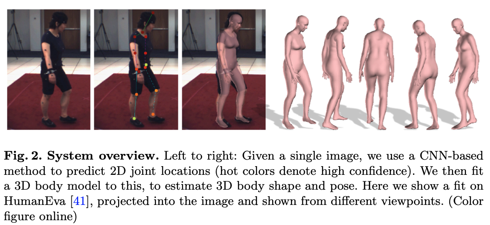

# [SMPLify] Keep It SMPL: Automatic Estimation of 3D Human Pose and Shape from a Single Image

`3DV` `HMR`

## 符号

- $J_\text{est}$: estimated 2D body joints
    - $w_i$: confidence value of joint $i$
- $M(\beta.\theta,\gamma)$: human body model (shape, pose, translation)
    - 输出 6890 vertices 的三角面片 mesh 表面
    - $J(\beta)$: 3D skeleton joint locations (@T-pose)
    - $R_\theta(J(\beta)_i)$: 用 $\beta$ 得到 T-pose 下的 joints location 后，再利用 $\theta$ 得到变形后的 posed joints
- $K$: perspective camera model parameters

## 输入输出

- 输入：single unconstrained image
- 输出：3D pose & 3D shape (3D mesh & 2D joints)

- [x]  强调的 automatic 是指什么？
    - 尽量少的人工干预，以及不需要提供一些基于具体数值的先验

## 方法

> single unconstrained image —[DeepCut]→ 2D joints —[SMPL fit]→ SMPL output
>

> 认为这个问题应当自上而下的判别方法和自下而上的生成方法相结合
>
1. 使用 DeepCut(CNN based method) 来 bottom-up 地估计 2D body joint
2. top-down 地用 SMPL 去 fit 上一步得到的 2D joints
    - 用 3D 模型 joints 的投影和 detected 2D joints 的误差做监督
    - 由于 SMPL 有男女性的区别，而为了避免推断性别，SMPLify 引入了中(neutral)性模型
    - 为了避免 3D pose 的歧义性，需要引入比较好的 pose prior

具体来说，主要阐述的是上方的第二点的方法：

1. 用“胶囊”来拟合 body
    - 为了解决穿插问题，我们需要对“几何体”做计算，为了提高效率，使用 proxy geometries 来近似的计算（也就是“胶囊(半球*2+圆柱*1)”，主要参数是 axis lenghtn 和 radius）
    - 首先用 20 个 capsules 构成的手搓模板开始来拟合 body
        - 训了一个 regressor 来实现  $\beta \rightarrow \text{(axis lenghtn, radius)}$ ，beta 和 capsule 共享 $R_\theta$
        - 优化 capsules 和 body shape 的双向距离
    - 目标函数（五个部分，包括  1 个 joint-based data term，3 个 pose priors 和 1 个 shape prior）

        

        - 第一项是 $E_J$ joint-based data term，监督 detected 2D joints 和 SMPL 回归出来的 3D joints 的投影（每个节点以 detected joints 的 confidence 为权重）

            

            - 这里的 $\rho$ 是一个 Geman-McClure penalty function，以 handle noisy estimates 来提供更鲁棒的输出（对于小的误差相对来说更敏感）
        - 第二项 $E_\theta$ 用来监督姿势是否“自然”

            

            - 大概就是整了 1 million 个来自 100 个 subjects 的 poses，然后弄成高斯分布进行监督，由于计算量的关系用最值来近似求和式，用常数 c 来修正这个近似带来的误差
            - [ ]  这一项了解的不是很透彻：
                - 具体来说，j 指代的是什么东西？
                - 这里的可微不可微具体是什么意思？那句 we approximate its Jacobian by the Jacobian of the mode with minimum energy in the current optimization step. 是什么意思？
        - 第三项 $E_a$ 是用来监督不自然的肘部、膝部弯曲的 pose prior：

            

            - 这里选择的 $i$ 都与肘部和膝部的弯曲有关，监督的都是这些东西的 rotation
            - 由于在 T-pose 下，即不旋转时 $\theta$ 是 0，在正常弯曲的时候 $\theta$ 是负的，而在反向旋转的时候 $\theta$  是正的，所以使用指数可以狠狠地惩罚 “hyperextending” 的旋转，即反向旋转的关节
        - 第四项 $E_\text{sp}$ 用来监督穿插问题

            

            - 由于 capsule 其实也不方便进行体积计算，所以实际上又用若干个球来近似每个 capsule（capsule 本质上也可以看成以 radius 为半径的球沿着 axis 运动得到）
            - 式子中的 $i$ 表示所有 spheres，$I(i)$ 表示与 spheres $i$ 不相容的所有球体， $\sigma_i(\beta) = \frac{r_i(\beta)}{3}$，用来“柔性”地表示 capsule 的“空间占用”，$C_i(\theta, \beta)$ 表示 sphere $i$ 的球心
            - 显然，这个碰撞惩罚不是严格的
            - 另外需要注意的是，这个式子虽然对 $\beta$ 可微，但仅用于监督 $\theta$，毕竟不能为了不让它碰撞而不断让结果越来越瘦
        - 第五项 $E_\beta(\beta)$ 是形状的 prior

            

            - 其中 $\Sigma^{-1}_\beta$ 是用 PCA 从 beta 里分析出来的 squared singular values 的对角矩阵，而 $\beta$ 是均值为 0 的形状系数
    - 优化步骤
        1. 相机参数
            1. 初始化
                - 假设相机参数已知或大概已知，并不优化它
                - 这里 camera translation 和 $\gamma$ 一致，即相机座标系
                - 假设人一开始和 image plane 平行
            2. 关于深度估计，用骨长的三角相似关系计算，依据是 SMPL 的一个平均形状和 detected joints 的骨长，由于这个估计是一个近似的初始化，接下来需要利用监督 $E_J$ 来优化 camera translation 和 body orientation
                - 在这个过程中，$\beta$ 始终使用 fixed mean shape 和 fixed focal length
        2. HMR 步骤
            - 利用上面给到的目标函数进行优化，实践中发现 $\lambda_\theta$ 和 $\lambda_\beta$ 较大的时候收敛较快
        3. 对于侧面的歧义性处理
            - 在人站得比较侧面的时候会有歧义产生，做法是首先用一个 threshold 检测人站得斜不斜，太侧了就两边都优化一下，选目标函数更小的那个输出
            - [ ]  为什么正面没有？假设人都主要面向镜头？

## 一些结论 / 额外产出

- 使用 SMPL 这种生成类的模型可以在有“穿插(interpenetration)”的情况下推理出合理的结果
    - 这个穿插可能是侧重肢体的“碰撞”，即避免 skeleton 的 bone 太近的情况
- 中性 SMPL 模型
    - 用了各 2000 个的 male & female 模型训的

## 参考

理解过程中除了原文也可以参考对比这些文章：

- [https://blog.csdn.net/weixin_43955293/article/details/121583909](https://blog.csdn.net/weixin_43955293/article/details/121583909)